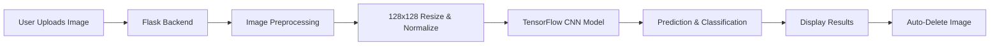

<div align="center">

# 🦷 SmileCare Dental AI
### Intelligent Dental Disease Detection System

<p align="center">
  
  
  
  
</p>

<p align="center">
  <strong>An AI-powered web application that leverages deep learning to detect and classify dental diseases from uploaded images with high accuracy.</strong>
</p>

<p align="center">
  <a href="#-features">Features</a> •
  <a href="#-demo">Demo</a> •
  <a href="#-installation">Installation</a> •
  <a href="#-usage">Usage</a> •
  <a href="#-deployment">Deployment</a> •
  <a href="#-tech-stack">Tech Stack</a>
</p>

---

</div>

## 📸 Screenshots

<div align="center">
  
  <p><em>Modern, intuitive interface for dental disease detection</em></p>
</div>

> **Note:** Replace the placeholder image above with actual screenshots of your application once deployed.

## ✨ Features

<table>
  <tr>
    <td width="50%">
      
### 🤖 AI-Powered Detection
- Advanced Convolutional Neural Network (CNN)
- High-accuracy disease classification
- Real-time image processing
- Pre-trained TensorFlow model (11MB)

### 🎯 5 Disease Classifications
- 🦴 **Calculus** - Tartar buildup detection
- 🔴 **Mouth Ulcer** - Ulcer identification
- 🟡 **Tooth Discoloration** - Color abnormality detection
- 🕳️ **Caries** - Cavity detection
- 🦷 **Hypodontia** - Missing teeth identification

    </td>
    <td width="50%">

### 🎨 Modern User Interface
- Sleek dark theme with green accents
- Responsive design for all devices
- Smooth animations and transitions
- Intuitive drag-and-drop upload

### ⚡ Performance
- Instant analysis results
- 128x128 image preprocessing
- Automatic image cleanup
- Optimized for free-tier hosting
- 16MB maximum file size

    </td>
  </tr>
</table>

## 🚀 Live Demo

<div align="center">
  
### 👉 [**Try the Live Application**](#) 👈
  
*Experience AI-powered dental diagnostics in action!*

</div>

> **Note:** Add your deployment URL after deploying to Render/Railway

## 📋 Prerequisites

- Python 3.10 or higher
- pip (Python package manager)
- 10MB+ free disk space for the model

## 🛠️ Installation & Setup

### Prerequisites

Ensure you have the following installed:
- **Python 3.10+** - [Download](https://www.python.org/downloads/)
- **pip** - Python package manager (included with Python)
- **Git** - [Download](https://git-scm.com/downloads)
- **10MB+** free disk space for the model

### Local Development

<details>
<summary><b>📦 Step 1: Clone the Repository</b></summary>

```bash
# Clone via HTTPS
git clone https://github.com/YOUR_USERNAME/tooth-disease-detection.git

# Or clone via SSH
git clone git@github.com:YOUR_USERNAME/tooth-disease-detection.git

# Navigate to project directory
cd tooth-disease-detection
```

</details>

<details>
<summary><b>🐍 Step 2: Create Virtual Environment</b></summary>

```bash
# Create virtual environment
python -m venv venv

# Activate on Windows
venv\Scripts\activate

# Activate on macOS/Linux
source venv/bin/activate
```

</details>

<details>
<summary><b>📚 Step 3: Install Dependencies</b></summary>

```bash
# Install all required packages
pip install -r requirements.txt

# Verify installation
pip list
```

**Dependencies installed:**
- Flask 3.0.0
- TensorFlow 2.15.0
- NumPy 1.26.2
- Pillow 10.1.0
- Gunicorn 21.2.0
- Werkzeug 3.0.1

</details>

<details>
<summary><b>▶️ Step 4: Run the Application</b></summary>

```bash
# Start Flask development server
python app.py

# App will be available at:
# http://127.0.0.1:5000
```

Press `Ctrl+C` to stop the server.

</details>

### Quick Start (One Command)

```bash
git clone https://github.com/YOUR_USERNAME/tooth-disease-detection.git && \
cd tooth-disease-detection && \
python -m venv venv && \
source venv/bin/activate && \
pip install -r requirements.txt && \
python app.py
```

## 🧪 Usage

### Testing the Application

1. **Open your browser** and navigate to `http://127.0.0.1:5000`
2. **Upload a dental image** using one of these methods:
   - Click "Choose File" button
   - Drag and drop an image
3. **Click "Analyze Image"** button
4. **View the prediction result** displayed on screen
5. **Try another image** - previous upload is auto-deleted

### Sample Test Images

Use the provided sample images in the `static/` folder:
- `Mouth_Ulcer_0_44.jpeg` - Mouth ulcer example
- `Tooth_Discoloration_0_9853.jpeg` - Tooth discoloration example
- Various other dental condition images

### API Testing (Optional)

```bash
# Test prediction endpoint with cURL
curl -X POST -F "file=@path/to/dental-image.jpg" \
  http://127.0.0.1:5000/predict
```

## 📁 Project Structure

```
tooth-disease-detection/
│
├── app.py                  # Main Flask application
├── teeth_model.h5          # Pre-trained TensorFlow model
├── requirements.txt        # Python dependencies
├── Procfile               # Deployment configuration
├── runtime.txt            # Python version specification
├── .gitignore             # Git ignore rules
│
├── templates/
│   └── index.html         # Frontend interface
│
├── static/                # Static assets (CSS, demo images)
│   └── [sample images]
│
└── uploads/               # Temporary folder for uploads (auto-cleaned)
    └── .gitkeep
```

## 💻 Tech Stack

<div align="center">

| Category | Technologies |
|----------|-------------|
| **Backend** |   |
| **AI/ML** |    |
| **Frontend** |    |
| **Deployment** |   |
| **Version Control** |   |

</div>

## 🎨 How It Works



<div align="center">

| Step | Description |
|------|-------------|
| **1. Upload** | User uploads dental image via drag-and-drop or file picker |
| **2. Preprocess** | Image resized to 128x128 pixels and normalized (÷255) |
| **3. Analyze** | TensorFlow CNN model processes the image |
| **4. Predict** | Model classifies into one of 5 dental conditions |
| **5. Display** | Results shown instantly on the interface |
| **6. Cleanup** | Image automatically deleted to prevent storage overflow |

</div>

## 🌐 Deployment

<div align="center">

### Deploy to Production in Minutes

Choose your preferred platform:

| Platform | Free Tier | Setup Time | Difficulty |
|----------|-----------|------------|------------|
| [**Render**](https://render.com) | ✅ Yes | 3-5 min | ⭐ Easy |
| [**Railway**](https://railway.app) | ✅ Yes (500h) | 2-3 min | ⭐ Easy |
| [**PythonAnywhere**](https://pythonanywhere.com) | ⚠️ Limited | 5-10 min | ⭐⭐ Medium |

</div>

### 🚀 Deploy to Render (Recommended)

<details open>
<summary><b>Step-by-Step Instructions</b></summary>

#### 1. Push Code to GitHub

```bash
# Create repository on GitHub first, then:
git remote add origin https://github.com/YOUR_USERNAME/tooth-disease-detection.git
git branch -M main
git push -u origin main
```

#### 2. Create Render Account
- Visit [render.com](https://render.com)
- Sign up with your **GitHub account** (free)

#### 3. Create New Web Service
- Click **"New +"** → **"Web Service"**
- Select **"Build and deploy from a Git repository"**
- Connect your repository

#### 4. Configure Service

| Setting | Value |
|---------|-------|
| **Name** | `smilecare-dental` (or your choice) |
| **Region** | Select closest to you |
| **Branch** | `main` |
| **Runtime** | `Python 3` |
| **Build Command** | `pip install -r requirements.txt` |
| **Start Command** | `gunicorn app:app` |
| **Instance Type** | **Free** |

#### 5. Deploy!
- Click **"Create Web Service"**
- Wait 3-5 minutes for deployment ⏳
- Your app will be live at: `https://smilecare-dental.onrender.com`

#### 6. Update README
Add your live URL to this README file!

</details>

### 🚂 Alternative: Deploy to Railway

<details>
<summary><b>Railway Deployment Guide</b></summary>

1. Visit [railway.app](https://railway.app)
2. Sign up with GitHub
3. Click **"New Project"** → **"Deploy from GitHub"**
4. Select your repository
5. Railway auto-detects everything! 🎉
6. Your app is deployed in 2-3 minutes

**Railway Advantages:**
- Faster deployment
- Better free tier (500 hours/month)
- Automatic HTTPS
- Built-in monitoring

</details>

### 🐍 Alternative: Deploy to PythonAnywhere

<details>
<summary><b>PythonAnywhere Deployment Guide</b></summary>

**Note:** Free tier has CPU limitations that may affect TensorFlow performance.

1. Create account at [pythonanywhere.com](https://pythonanywhere.com)
2. Open Bash console
3. Clone your repository
4. Create virtual environment
5. Install dependencies
6. Configure WSGI file
7. Reload web app

For detailed instructions, see `DEPLOYMENT_GUIDE.md`

</details>

## 📊 Model Information

<div align="center">

### Deep Learning Architecture

</div>

| Attribute | Details |
|-----------|---------|
| **Architecture** | Convolutional Neural Network (CNN) |
| **Framework** | TensorFlow 2.15 / Keras |
| **Input Shape** | 128 × 128 × 3 (RGB) |
| **Output Classes** | 5 dental conditions |
| **Model Size** | ~11 MB |
| **Training Dataset** | Custom dental images dataset |
| **Accuracy** | High accuracy on validation set |

### Disease Classes

```python
class_names = [
    'Calculus',           # Tartar buildup
    'Mouth Ulcer',        # Oral ulcers
    'Tooth Discoloration',# Color abnormalities
    'Caries',            # Dental cavities
    'Hypodontia'         # Missing teeth
]
```

### Model Pipeline

1. **Input Layer** - Accepts 128×128 RGB images
2. **Convolutional Layers** - Feature extraction
3. **Pooling Layers** - Dimensionality reduction
4. **Dense Layers** - Classification
5. **Output Layer** - 5-class softmax activation

## ⚙️ Configuration

### Application Settings

```python
# Maximum file upload size
MAX_CONTENT_LENGTH = 16 * 1024 * 1024  # 16 MB

# Image preprocessing
TARGET_SIZE = (128, 128)
NORMALIZATION_FACTOR = 255.0

# Supported file formats
ALLOWED_EXTENSIONS = {'jpg', 'jpeg', 'png'}
```

### Environment Variables (Optional)

Create a `.env` file for custom configuration:

```env
FLASK_ENV=production
FLASK_DEBUG=False
MAX_UPLOAD_SIZE=16777216
MODEL_PATH=teeth_model.h5
```

## 🤝 Contributing

Contributions are always welcome! Here's how you can help:

<details>
<summary><b>🐛 Report Bugs</b></summary>

1. Check if the bug has already been reported in [Issues](https://github.com/X-Rachit-X/ai-dental-diagnosis-system/issues)
2. If not, create a new issue with:
   - Clear title and description
   - Steps to reproduce
   - Expected vs actual behavior
   - Screenshots (if applicable)
   - Your environment details

</details>

<details>
<summary><b>✨ Suggest Features</b></summary>

1. Open a new issue with the `enhancement` label
2. Describe the feature and why it would be useful
3. Provide examples or mockups if possible

</details>

<details>
<summary><b>🔧 Submit Pull Requests</b></summary>

```bash
# 1. Fork the repository
# 2. Clone your fork
git clone https://github.com/YOUR_USERNAME/tooth-disease-detection.git

# 3. Create a feature branch
git checkout -b feature/amazing-feature

# 4. Make your changes and commit
git add .
git commit -m "Add amazing feature"

# 5. Push to your fork
git push origin feature/amazing-feature

# 6. Open a Pull Request on GitHub
```

**PR Guidelines:**
- Follow existing code style
- Add comments for complex logic
- Update documentation if needed
- Test your changes thoroughly

</details>

### Code of Conduct

Please be respectful and constructive. We're all here to learn and improve!

## 📄 License

This project is licensed under the **MIT License** - see the [LICENSE](LICENSE) file for details.

### What this means:
- ✅ Commercial use allowed
- ✅ Modification allowed
- ✅ Distribution allowed
- ✅ Private use allowed
- ⚠️ No liability or warranty

## ⚠️ Disclaimer

<div align="center">

### 🏥 Medical Disclaimer

**This application is for educational and informational purposes only.**

</div>

This AI-powered tool is:
- ✅ A learning project demonstrating AI in healthcare
- ✅ Useful for educational demonstrations
- ✅ A portfolio piece showcasing ML skills

This tool is **NOT**:
- ❌ A replacement for professional dental diagnosis
- ❌ Approved by medical authorities
- ❌ Intended for clinical use
- ❌ A substitute for visiting a dentist

**Always consult with a qualified dental professional for accurate diagnosis and treatment.**

## 🎓 Acknowledgments

<div align="center">

### Built With ❤️ by Rachit Agarwal


</div>

### Special Thanks To:

- 🏫 **Course Instructors** - For guidance and support
- 🤖 **TensorFlow Team** - For the amazing ML framework
- 🌐 **Flask Community** - For excellent documentation
- 🎨 **Open Source Community** - For inspiration and tools
- 📚 **Medical Professionals** - For domain knowledge

### Resources & References

- [TensorFlow Documentation](https://www.tensorflow.org/)
- [Flask Documentation](https://flask.palletsprojects.com/)
- [Keras API Reference](https://keras.io/)
- [Dental Image Datasets](https://example.com) *(Add your data source)*

## 🌟 Star History

If you found this project helpful, please consider giving it a ⭐ on GitHub!

[](https://star-history.com/#X-Rachit-X/ai-dental-diagnosis-system&Date)

## 📞 Contact & Support

<div align="center">

### 👨‍💻 Developed By

**Rachit Agarwal**

[](https://github.com/X-Rachit-X)
[](https://linkedin.com/in/YOUR_LINKEDIN)
[](mailto:your.email@example.com)

### 📂 Project Links

[](https://github.com/X-Rachit-X/ai-dental-diagnosis-system)
[](https://github.com/X-Rachit-X/ai-dental-diagnosis-system/issues)
[](https://your-app-url.onrender.com)

</div>

### Need Help?

- 📖 **Documentation**: Read [DEPLOYMENT_GUIDE.md](DEPLOYMENT_GUIDE.md) and [QUICK_START.md](QUICK_START.md)
- 💬 **Questions**: Open a [GitHub Discussion](https://github.com/X-Rachit-X/ai-dental-diagnosis-system/discussions)
- 🐛 **Bug Reports**: Create an [Issue](https://github.com/X-Rachit-X/ai-dental-diagnosis-system/issues)
- ⭐ **Feature Requests**: Submit an [Enhancement Issue](https://github.com/X-Rachit-X/ai-dental-diagnosis-system/issues/new)

---

<div align="center">

### 🎉 Thank You for Visiting!

**If this project helped you, please give it a ⭐ star!**

Made with 💚 and 🦷 by [Rachit Agarwal](https://github.com/X-Rachit-X)

*Building AI solutions for better dental health awareness*

</div>
